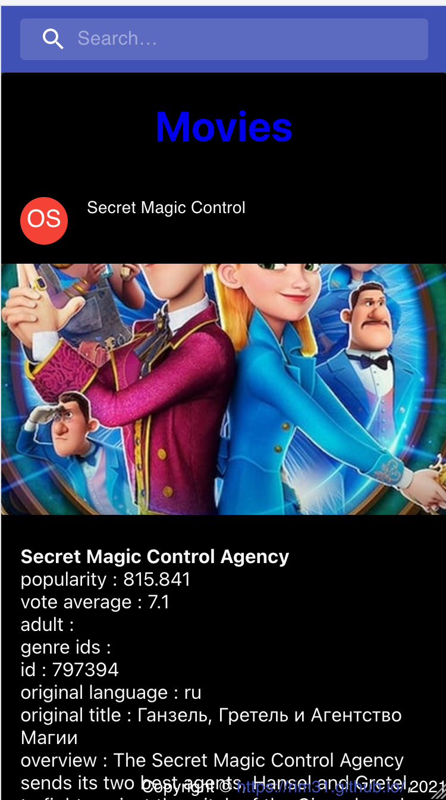

# With Create React App
This project was bootstrapped with [Create React App](https://github.com/facebook/create-react-app).


Movie example
- unstated-next (redux like)
- design material-ui
- search bar
- layout
- responsive
- fetch api
- react-router
- interfaces in utils.ts


## Available Scripts

In the project directory, you can run:

### `yarn start`

Runs the app in the development mode.\
Open [http://localhost:3000](http://localhost:3000) to view it in the browser.

The page will reload if you make edits.\
You will also see any lint errors in the console.

## Explanation

```
├── App.tsx
├── components
│   ├── Store.tsx
│   ├── layout
│   │   ├── MySearch.tsx
│   │   └── NavBar.tsx
│   └── pages
│       ├── Details.tsx
│       ├── Home.tsx
│       └── Movies.tsx
├── index.tsx
└── utils.ts
```

Redux like: unstated :
- action and state management in the Store.tsx

1. Home


redirect on Movies clicking on Favorite movies

2. Movies


clicking on a movie : go to details of the movie

3. Details


# mobile mode

- Responsive :





# To improve
- design, image fit 
